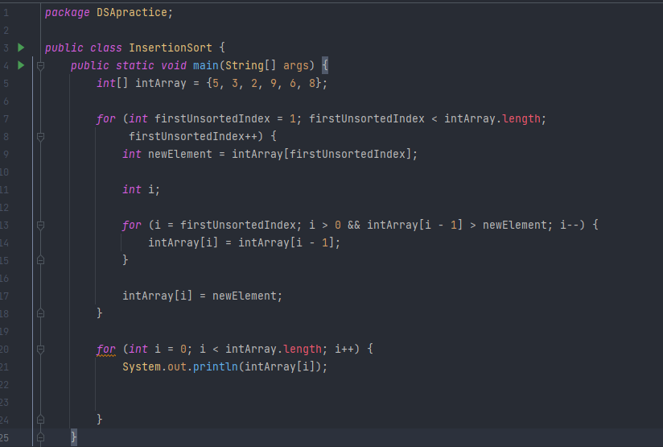
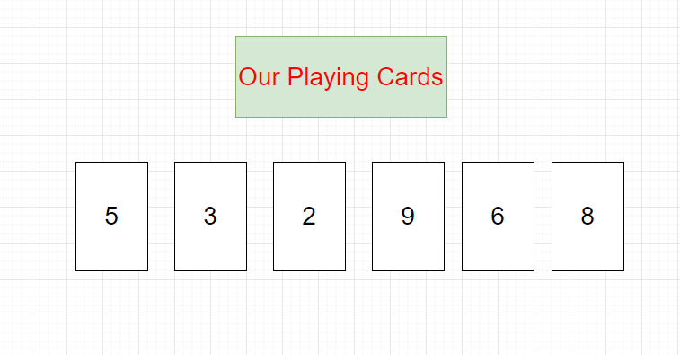
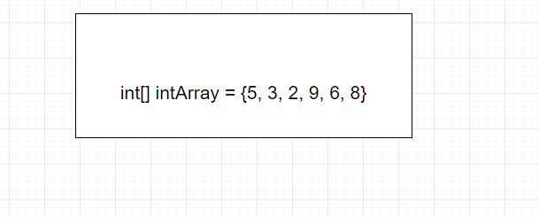
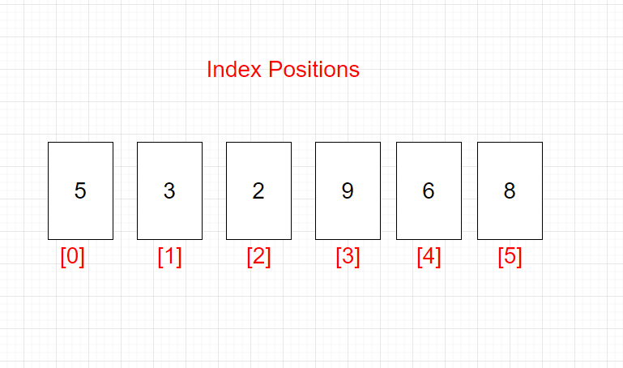
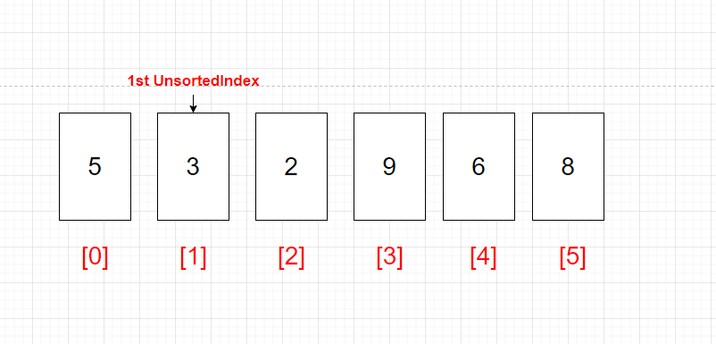
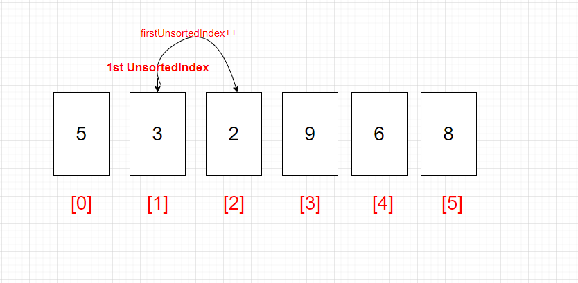
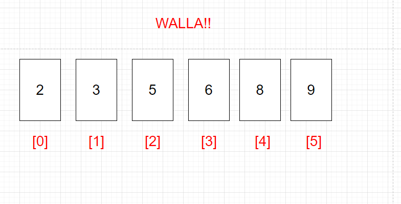

# Insertion Sort Array
## Scenerio:
### Imagine for a minute that you were given 6 playing cards. For whatever reason they are only cards 1 through 10.  You lay them randomly out in front of you and you see 5, 3, 2, 9, 6, 8.  If you wanted to arrange them in numeric order you would just maneuver the cards until they were 2, 3, 5, 6, 8, 9.  Simple enough.  Your brain is a powerful computing device and you would likely be able to arrange the numbers with little thought. Even though you don't consciously think about it your brain is using logic to arrange them in an order it knows as numerical.  

## Computers. Just a faceless brain.
### Now computers are less complicated brains without the pretty face in front of it.  Only catch is, it's not your brain. So you must tell the computer to do the instructions in a precise and orderly way.  

## JAVA Time
### If we want to do this in Java we will need to follow some orderly steps.
### #1 First thing is we tell it we want it to do something by creating a Method, or a set of instruction per se. We can assign it a class to start.

### Now we will tell the computer what we are looking at and how we want it to deal with the instruction. It will look something like this.

## Let's look at what happened: 
### Our Playing cards looked like this.  

### We told the computer, what they looked like so the computer could understand.

### Computers store the information in an array with index numbers.  For reasons, I can't explain, they start at zero.   

### Now the method tells the computer the firstUnsortedIndex is equal to 1. We don't start at zero because there would be nothing in front of index 0 to compare the number to.

### The computer will start at 3 and move forward one index position at a time as long as firstUnsortedIndex is less than the length of the array.

### Now we instantiate newElement as the intArray. The computer now knows going forward that newElement and intArray at index [i] are the same. 
### `int newElement = intArray[firstUnsortedIndex]` so we tell it `int i;`

### Now we need to instruct it to iterate, or jump through the arrays indexes, one position at a time. As long as i is greater than 0 and larger than intArray at i - 1.
### `i > 0 && intArray[i - 1]`

### Now for the shift if the intArray at i -1 is greater than newElement we are going to shift i to the left.
### `i > 0 && intArray[i - 1] > newElement; i--` the shift `intArray[i] = intArray[i -1];`

### Last but not least we tell are little faceless brain, the computer, that intArray at i is now newElement `intArray[i] = newElement`

